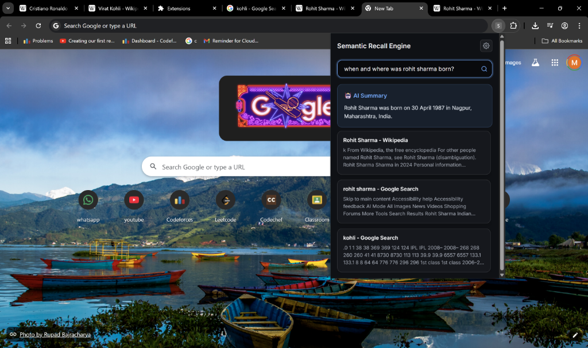
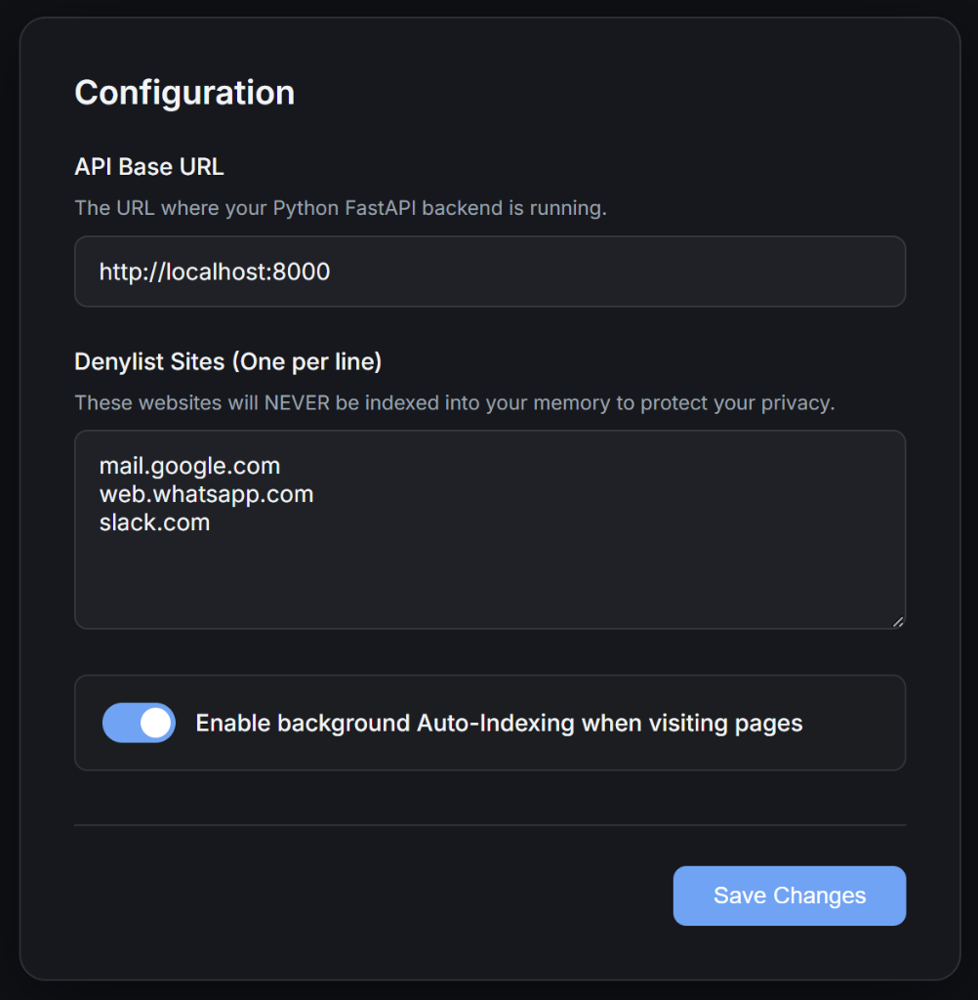
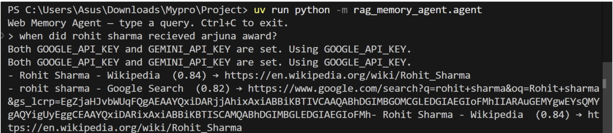
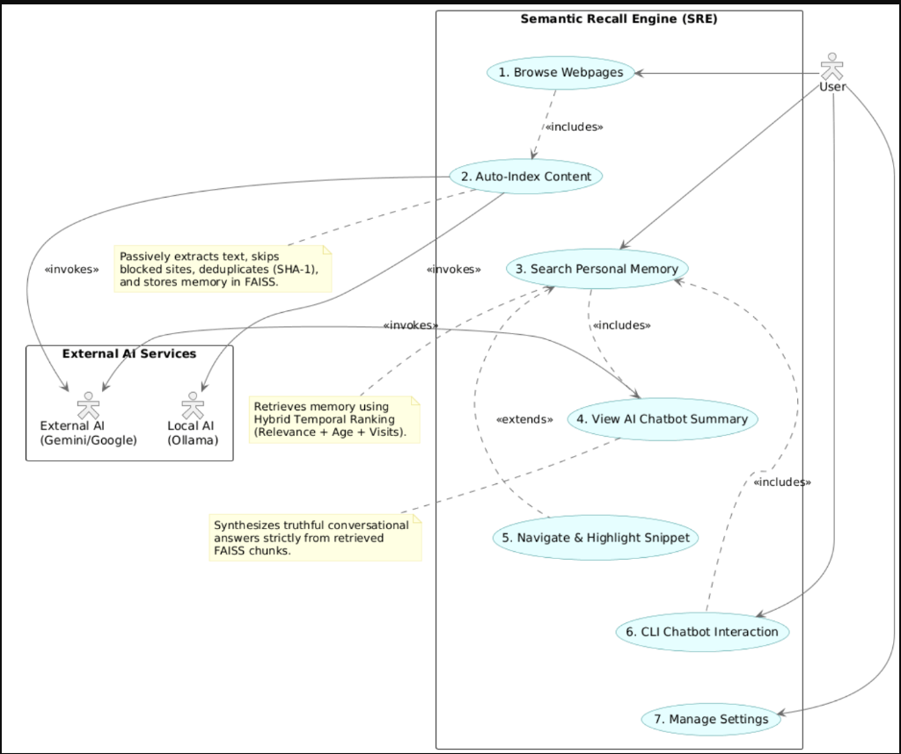
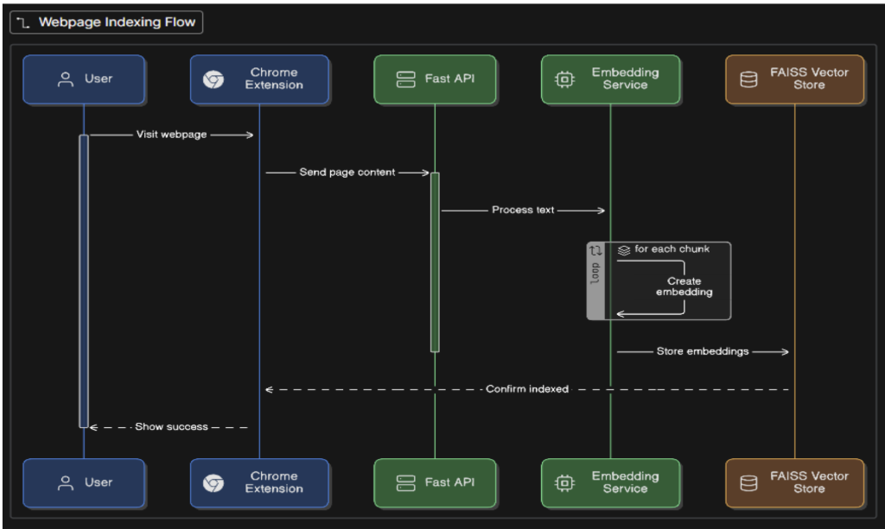
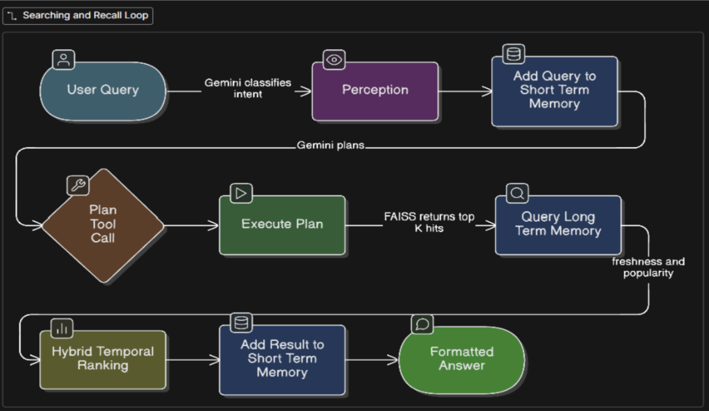

# Semantic Recall Engine (SRE)

### Problem statement
Nowadays, practically all knowledge work is done on Browser. Every day, people read News, discussion threads, research papers, blogs and documentation. Although people consume information digitally, human memory is limited for recall.
Existing Browsers don't actually keep track of what a particular user has read. Instead of remembering what a user has read in the past, search engines re-query the entire internet.

### Core problem
The main challenge is to create an AI memory system that is continuous, time-aware, and relevance-preserving. This system should be able to recall what a user read, where they read it, and when they read it on the web, and retrieve it later with semantic precision and source links when the user queries about it.

### Relation to AI Native News Experience
This problem is directly aligned with an AI-native news experience because modern news consumption is high-volume, fast-changing, and fragmented across sources. An AI memory layer would enable users to:
* Continuously track and organize news they have already consumed
* Retrieve past news contextually (e.g., “What did I read about this topic last week?”)
* Maintain temporal awareness of evolving stories
* Avoid redundancy and information overload
* Build a personalized, evolving knowledge graph of news consumption

### Who it impacts
It will  impact every browser user. Reliable recall is beneficial for anyone who reads, learns, investigates, compares products, examines documentation, or bases decisions on information found online.
In particular, it helps knowledge workers, engineers, product managers, analysts, researchers, students, and lawyers who need precise, source-supported recollection of previously read web content.

---

## Interface Previews & Demonstration

<div align="center">
  
  <p><i>The search interface of the Semantic Recall Engine popup.</i></p>

  
  <p><i>Integrated AI summary appearing alongside regular Google search results.</i></p>

  
  <p><i>Settings pane for configuration, API routing, and managing the privacy denylist.</i></p>

  
  <p><i>Interactive terminal agent for executing recall queries via the command line.</i></p>
</div>

### PPT & Action Demo
[Watch the full PPT & Action Demo Video on Google Drive](https://drive.google.com/file/d/1HAB70tyG3K_SjALVA8YVslxwII-DKqfp/view?usp=sharing)


## System Architecture

The overarching design is inspired by logical reasoning steps: **Observation → Comprehension → Storage → Planning → Execution**. Each interconnected layer leans heavily on modern Gemini LLMs combined with high-speed vector retrieval.

### Use Case Diagram




### Architecture components
* **Perception (LLM):** extract intents, classify page region to index, normalize titles.
* **MCP Tools:** index_page, search_documents, process_documents 
* **Action:** function execution + write-back to working memory.
* **Memory:** short-term session stored in RAM for context; long-term FAISS for persistent recall.

---

## Primary Capabilities

*   **Intelligent Reasoning via Gemini:** The engine exclusively uses advanced models like Gemini 3.1 Flash-Lite to orchestrate searches and summarize answers naturally.
*   **Flexible Vector Generation:** Toggle easily between cloud-hosted Google embeddings for maximum accuracy, or local Nomic embeddings for complete offline privacy.
*   **Time-Decay Algorithms:** Employs temporal scoring techniques to ensure the most recently consumed information surfaces first.
*   **Storage Optimization:** Prevents bloated databases by utilizing SHA-1 hash deduplication.
*   **Dual-Tier Memory System:** Pairs short-term session tracking with permanent FAISS storage to maintain an ongoing dialogue seamlessly.
*   **Conversational Summaries:** Beyond returning URLs, the internal chatbot synthesizes a direct answer strictly derived from your personal web history.
*   **Popularity Scoring:** Incorporates a dedicated `/visit` route to monitor how often you access certain pages, passively enhancing their relevance.
*   **Multi-Platform Access:** Exposes capabilities simultaneously over standard HTTP REST and standardized MCP protocols.
*   **Universal Ingestion:** Can rip and embed markdown from standard HTML, PDFs, and Word documents via MarkItDown.
*   **Browser-Native Client:** A fully functional Chrome Manifest V3 extension serves as the primary visual interface and automated web scraper.

---

## Technology Stack Overview

| Category | Selected Tooling | Primary Function |
| :--- | :--- | :--- |
| **Logic & Reasoning** | Gemini 3.1 Flash-Lite / 2.0 Flash | Powers cognitive planning and response synthesis |
| **Vectorization** | Google `text-embedding-004` / Ollama | Transforms plain text into mathematical vectors |
| **Database** | FAISS | Enables high-speed semantic similarity lookups |
| **Routing** | FastAPI & Uvicorn | Acts as the robust API gateway for browser interaction |
| **Integration** | Model Context Protocol (MCP) | Allows native hooking into external AI agent systems |
| **Text Parsing** | MarkItDown | Strips noise from complex web documents |
| **Environment** | `uv` Package Manager | Ensures lightning-fast virtual environment setup |

---

## Data Processing Pipelines

### 1. Ingestion



*   **Extract:** Extract textual content from the webpage.
*   **Chunking:** Split text into overlapping semantic chunks (~1000 chars, ~150 overlap) to preserve context.
*   **Embedding:** Convert each chunk into a vector and attach metadata `{url, title, chunk_id, timestamp, visit_count}`.
*   **Indexing:** Store vectors in FAISS for similarity search and prevent duplicates using SHA-1 hashing.

### 2. Retrieval



*   **Convert:** Convert the user query into the same vector space.
*   **Semantic Search:** Retrieve top-k similar chunks using cosine similarity.
*   **Hybrid Re-ranking:** Adjust ranking using temporal and behavioral signals. It ranks results based on how closely the content matches the user’s query. The most crucial element is that match (semantic similarity), and the system modifies the ranking a little bit depending on how frequently and recently the page has been viewed. Pages that the user has visited frequently and recent pages receive a slight priority boost, but this increase levels off so they don't take over the ranking.

---

## Deployment & Installation Guide

### 1. Setup Your Blueprint
Initialize the project structure quickly using `uv`:
```bash
uv venv
uv sync
```

### 2. Configure Your Embedding Engine
Decide whether you want maximum privacy (Local) or peak quality (Cloud).

**Path A: Complete Offline Privacy (Ollama)**
1. Install [Ollama locally](https://ollama.com/download).
2. Download the Nomic model:
   ```bash
   ollama pull nomic-embed-text
   ollama serve
   ```
3. Update your `.env` file target:
   ```bash
   EMBEDDINGS_PROVIDER=ollama
   EMBED_URL=http://localhost:11434/api/embeddings
   EMBED_MODEL=nomic-embed-text
   ```

**Path B: Cloud Precision (Google)**
1. Enter your credentials in the `.env` file:
   ```bash
   EMBEDDINGS_PROVIDER=google
   GOOGLE_API_KEY="<your_api_key_here>"
   GOOGLE_EMBED_MODEL=text-embedding-004
   ```

### 3. Launch the Server
Boot up the main FastAPI endpoint:
```bash
uv run uvicorn semantic_recall_engine.http:app --reload --port 8000
```

### 4. Interactive Terminal Agent
If you bypass the graphical UI, you can chat directly from your command line:
```bash
uv run python -m semantic_recall_engine.agent
> Which article broke down HNSW structures?

SRE Synopsis:
Based on your browsing, HNSW indexing helps speed up nearest-neighbor cluster searches...
```

---

## The Chrome Extension: Visualizing Memory

SRE includes a built-in Chrome Extension (Manifest V3) that quietly bookmarks paragraph texts from sites you visit and provides dynamic text-highlighting when you revisit them.

### Quick Setup
1. Launch Google Chrome and navigate to `chrome://extensions`.
2. Turn on **Developer mode** at the top right.
3. Choose **Load unpacked** and point it to the SRE `extension/` folder.
4. Pin the **Semantic Recall Engine** logo to your Chrome toolbar.

### Extension Highlights
* **Hands-Free Ingestion:** Automatically archives textual data while you read.
* **Privacy Controls:** Ignore intrusive or sensitive sites (like webmail or slack) via the internal Denylist.
* **Contextual Jump:** When you search and click on a past memory, the browser will force-scroll and visually mark the exact snippet you searched for.

---

## Hybrid Scoring Mechanics

SRE doesn't just rely on raw match percentages; it heavily factors in **when** and **how often** you've consumed a piece of knowledge. 

### Concept Formula

```python
# Context Retrieval Score Calculation
score = (s_wt * sim_v) + (t_wt * ctx_v)
```

**Definitions:**
* `ctx_v = (f_wt * age_d) + (p_wt * freq_b)`
* `age_d = exp(-k * days_old)` (Memory fades as it gets older)
* `freq_b = 1 - exp(-hits/c)` (Score boosts automatically on revisits)

*   **`sim_v` (Semantic Fit):** Dictates absolute relevance. A high score means the text genuinely answers your query.
*   **`age_d` (Time Decay):** Prevents highly-matched but outdated information from burying new discoveries.
*   **`freq_b` (Loyalty Boost):** Awards slight algorithmic bumps to URLs you revisit consistently.

In essence: **Similarity ensures accuracy, while temporal dynamics ensure freshness.**

---
